# [관리] 운영 체크리스트

차량 1대를 매입부터 정산까지 책임지고 끌고 가는 흐름. 막히는 지점마다 해제 방법 함께.

---

## 0. 처음 한 번만 — 사전 준비

### 0-1. 본인 계정 확인
- [ ] 본인 계정 권한 — 역할이 **"관리"** 인지 확인 (사용자 관리 메뉴)

### 0-2. 영업담당자(휘하 직원) 등록 — 사용자 관리 메뉴

내 휘하 영업담당자를 한 명씩 등록.

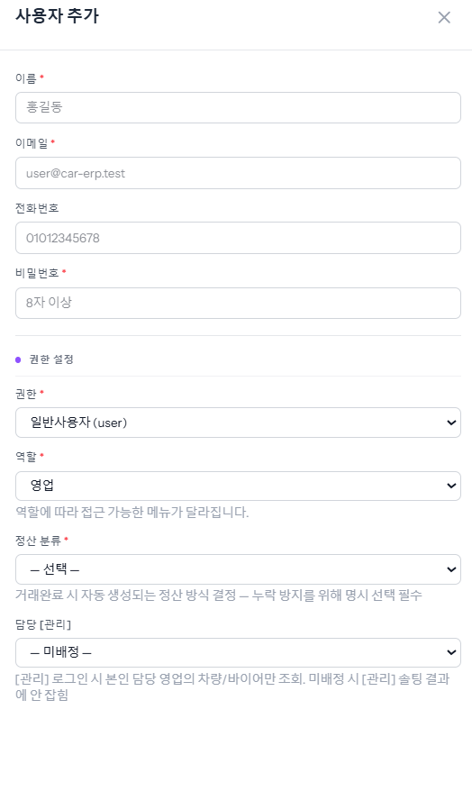

- [ ] **이름·이메일·전화·비밀번호** 입력
- [ ] **권한** = 일반사용자(user)
- [ ] **역할** = 영업 (또는 수출통관·재무 등)
- [ ] **정산 분류** 필수 — 사내직원(건당 정산) vs 프리랜서(비율 정산)
  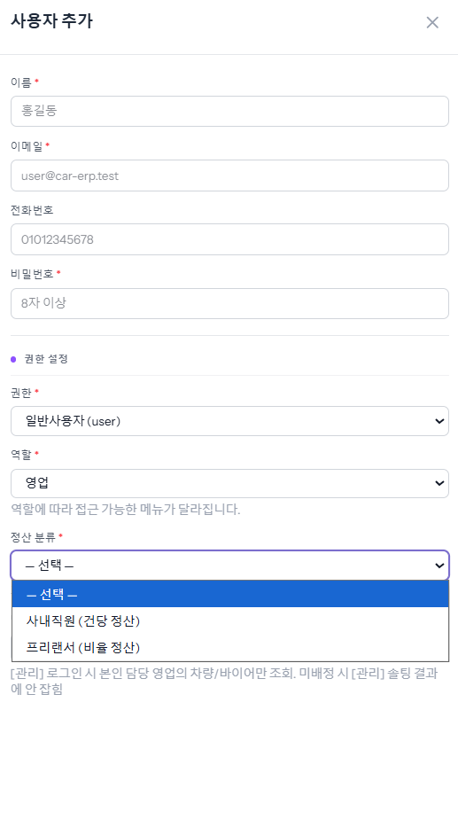
- [ ] **담당 [관리]** = 본인 선택 → 이 직원이 내 휘하로 등록됨
  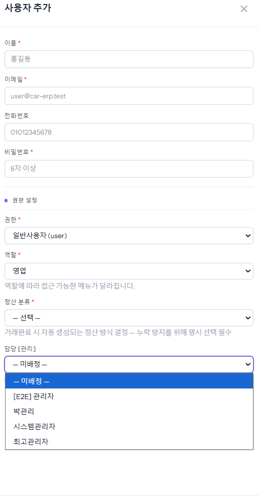

> ⚠️ 정산 분류 누락 시 거래완료 차량 정산액이 0으로 자동 처리됩니다. 반드시 명시.

### 0-3. 항구 등록 — 항구 마스터 메뉴

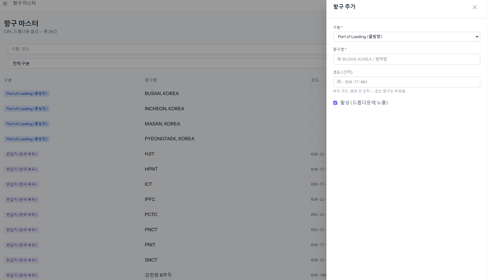

- [ ] **Port of Loading (출발항)** — BUSAN / INCHEON / MASAN / PYEONGTAEK 등 한국 출발 항구
- [ ] **반입지 (한국 부두)** — HJIT / HPNT / ICT / IPFC / PCTC 등 부두 코드
- [ ] **Discharge Port (도착항)** — 자동(바이어 국가) 또는 명시 등록

> 통관 단계에서 드롭다운으로 사용. 없는 항구는 "+ 항구 추가" 슬라이드 패널에서 등록 가능.

### 0-4. 포워딩사 등록
- [ ] **포워딩사 관리** 메뉴 → 수출통관 단계에서 사용할 포워딩사 등록

### 0-5. 바이어 / 컨사이니 등록

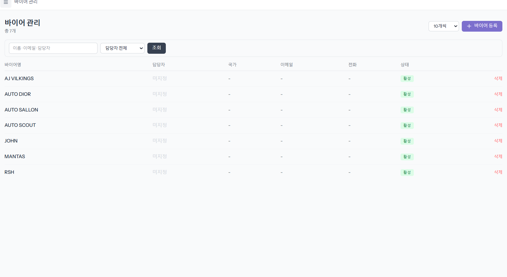

- [ ] **한두 건이면** — 메뉴에서 직접 추가 + 컨사이니 탭에서 컨사이니 추가
  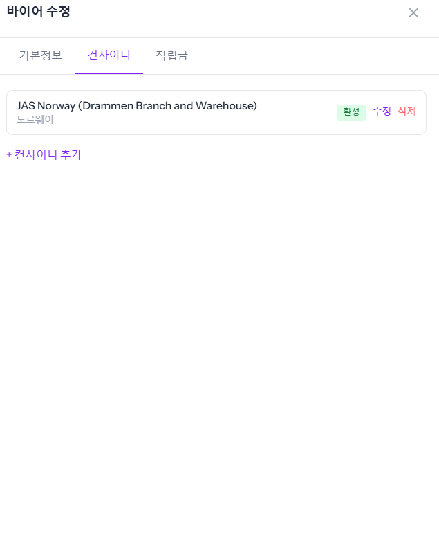
- [ ] **수십~수백 건이면** — **엑셀 일괄 업로드**
  - 양식: `바탕화면\컨사이니_업로드양식_v2.xlsx` (12컬럼: 바이어명·컨사이니명·국가·EORI·TAX·ID종류·ID번호·전화·이메일·영업담당자·주소·메모)
  - 사용자가 양식 채우면 → 개발자(진)에게 "이거 import 해줘" 요청 → 한 번에 7~수백 건 등록

---

## 한 대 처리 흐름 (1~8번 순서대로)

> 📌 **워크플로우 순서**: 매입 → 말소 → 판매 → **반입(선적) → 통관 → B/L** → DHL → 거래완료 → 정산
> ※ "선적"의 의미는 **반입지 입력**. 실제 운영 순서는 차량 반입 먼저, 그 다음 통관, 마지막에 B/L 발급.

---

### 1️⃣ 차량 등록 + 매입


#### 기본정보 탭 — 차량번호·NICE 자동 조회·소유자 정보

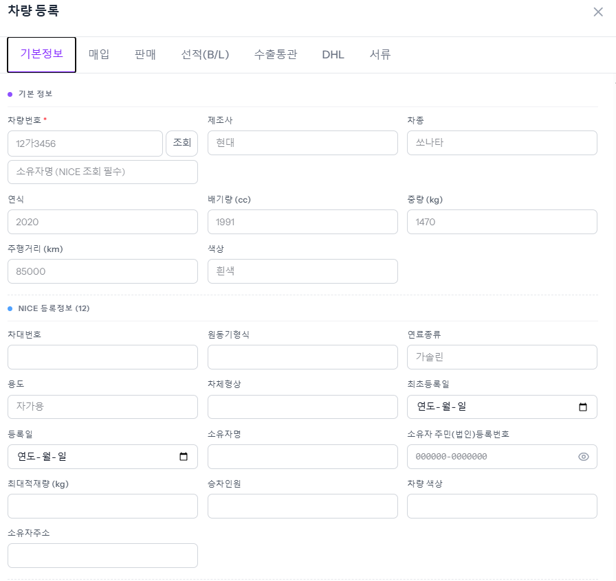

- [ ] **차량번호 입력** → 우측 **조회** 버튼 클릭 → NICE 자동 조회 (24개 항목 자동 채워짐)
- [ ] **NICE 등록정보 12** — 자동 채워진 항목 검토 (소유자명·등록일·최초등록일 등)
- [ ] **⚠️ 소유자 주민(법인)등록번호** — NICE는 RRN을 마스킹해서 줌. **차량 등록증 보고 수기 입력 필수** (말소신청서·통관 SET 서류 인쇄용)
- [ ] **⚠️ 소유자주소** — NICE 비제공. 수기 입력 (말소신청서·계약서 인쇄용)

> 💡 매입 단계에서 RRN·주소 미리 입력해두면 말소 단계에서 자동 활용 — 두 번 입력 안 해도 됨

#### 차량 사진 + 제원정보

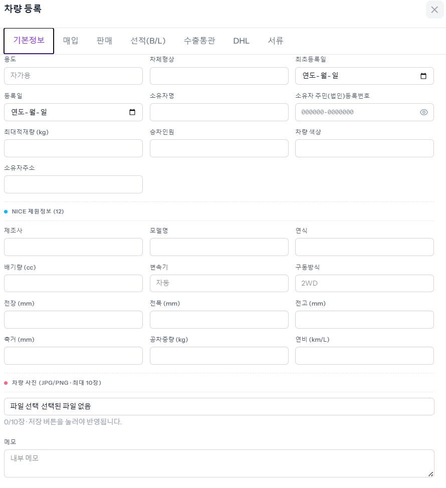

- [ ] **NICE 제원정보 12** — 자동 채워짐 (배기량·변속기·구동방식·전장·전폭·전고·연비 등)
- [ ] **차량 사진 (JPG/PNG · 최대 10장)** — 첨부 시 저장 버튼 눌러야 반영됨

#### 매입 탭 — 매입 정보 + 매입처 계좌

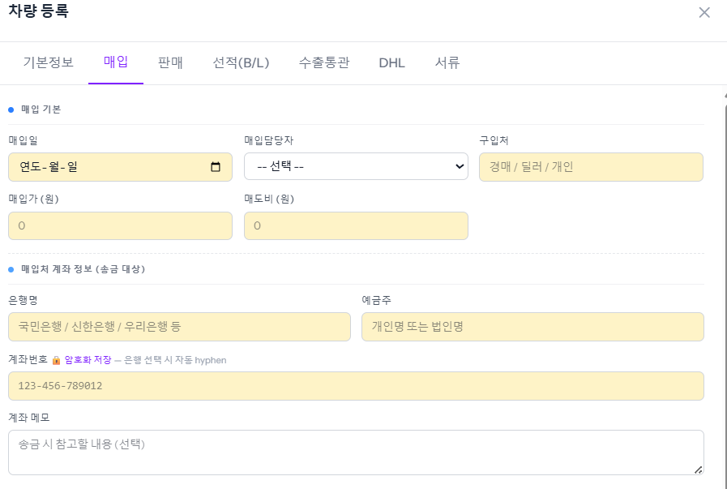

- [ ] **매입일·매입담당자·구입처·매입가·매도비** 입력
- [ ] **매입처 계좌 정보** — 은행명·예금주·계좌번호 (계좌번호는 자동 암호화 저장)

#### 비용 9개 + 매입 지급

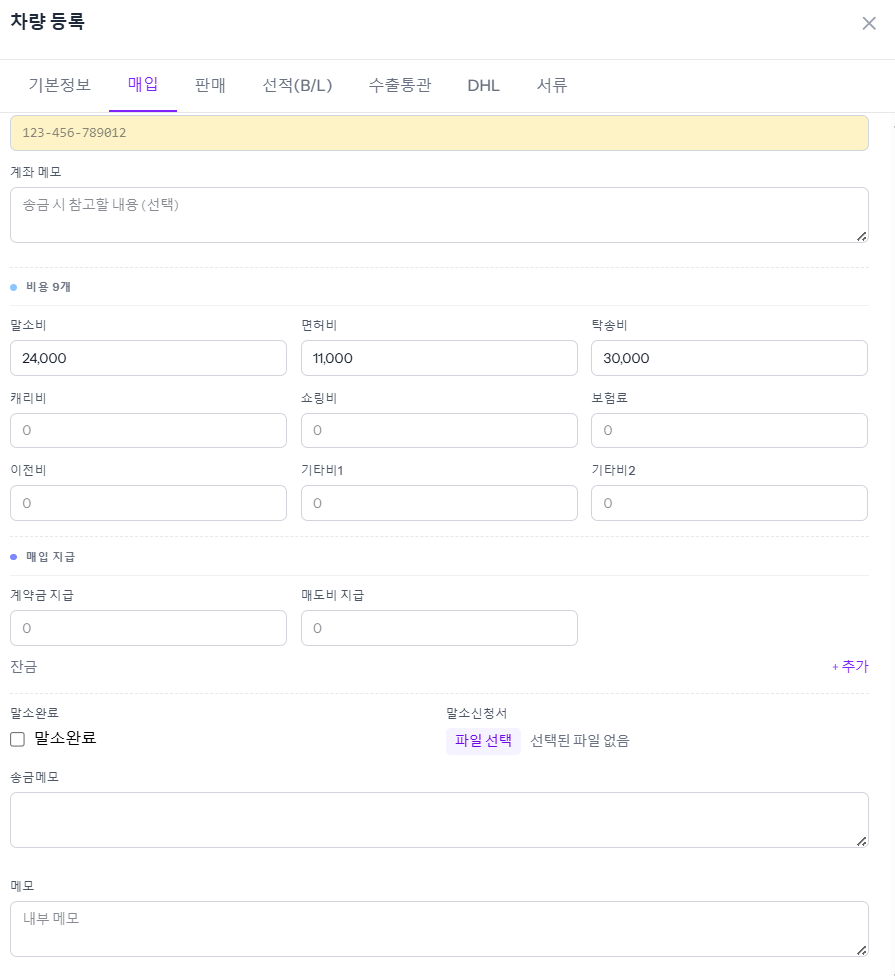

- [ ] **비용 9개** — 말소비·면허비·탁송비·캐리비·쇼링비·보험료·이전비·기타비1·기타비2
- [ ] **매입 지급** — 계약금 지급·매도비 지급·잔금(필요 시 + 추가)
- [ ] 진행상태가 **"매입중"** → 매입 잔금 다 지급 → **"매입완료"** 자동 전환

> 🔓 이 단계 막힘: **없음**

---

### 2️⃣ 말소

위 화면(매입 탭 하단)에서 말소도 같이 진행:

- [ ] **"말소완료" 체크박스** + 말소일 입력
- [ ] **말소신청서 파일 업로드** (말소 완료 후 받은 등록증)
- [ ] **서류 탭** → 자동 생성된 서류 다운로드해서 출력

#### 서류 탭 — 자동 생성 서류 9종

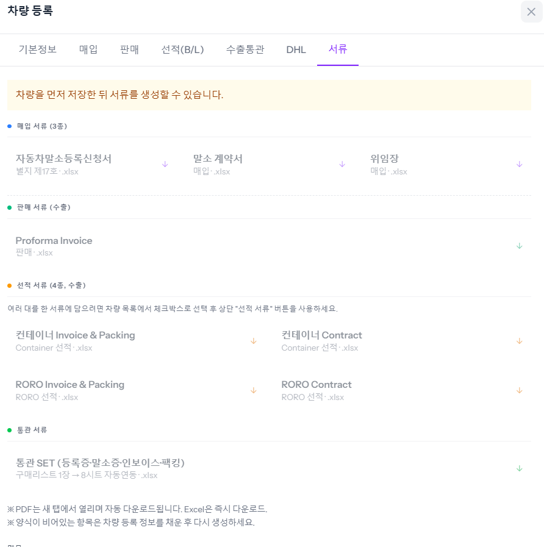

- [ ] **매입 서류 3종** — 자동차말소등록신청서·말소계약서·위임장
- [ ] **판매 서류** — Proforma Invoice (수출)
- [ ] **선적 서류 4종** — 컨테이너/RORO Invoice & Packing / Contract
- [ ] **통관 서류** — 통관 SET (구매리스트 1장 → 8시트 자동연동)

> ⚠️ 서류 생성 시 빈 칸이 있으면:
> - 주민등록번호 빈 칸 → 기본정보 탭에서 입력 후 재생성
> - 주소 빈 칸 → 기본정보 탭에서 입력 후 재생성
> - 양식이 비어있는 항목 → 차량 등록 정보를 채운 후 다시 생성

---

### 3️⃣ 판매

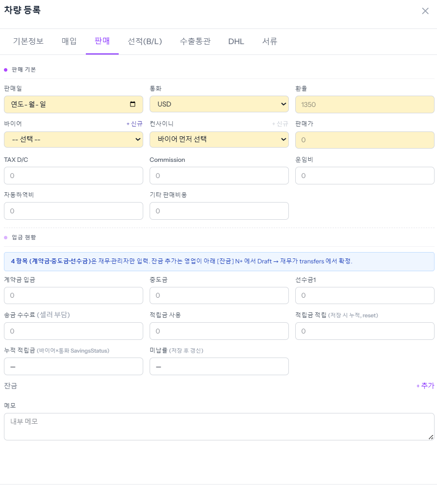

#### 판매 기본

- [ ] **판매일·통화·환율·바이어·컨사이니** 선택
- [ ] 바이어가 없으면 **+ 신규** 버튼으로 바로 등록 가능
- [ ] 판매가·**TAX D/C**(세금 할인)·**Commission**(중개수수료)·운임비·자동하역비·기타 판매비용 입력

#### 입금 현황 — 4 항목 (재무·관리자만 입력 가능)

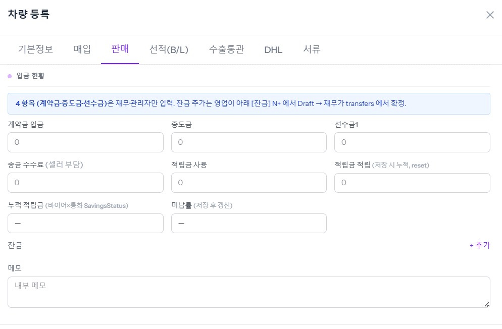

- [ ] **계약금 입금·중도금·선수금1** — 받은 만큼 입력
- [ ] **🆕 송금 수수료 (셀러 부담)** — 위치: 입금 현황 그리드 두 번째 줄 (계약금 입금 바로 아래)
  - 예: USD 5,000 송금 → 4,990 도착 + 10 수수료 → **계약금 4,990 + 송금 수수료 10**
  - 셀러(우리) 부담 → 미수금 자동 차감 (바이어는 5,000 다 보낸 것으로 인정)
  - 저장 시 환율 자동 snapshot → 누적 KRW 환산 자동
- [ ] **적립금 사용·적립금 적립** — 바이어 적립금에서 차감 또는 신규 적립
- [ ] **잔금** — 영업이 + 추가로 Draft 입력, 재무가 transfers에서 확정

#### 저장 후 — 4 항목 잠금 표시 + 바이어 카드 확인

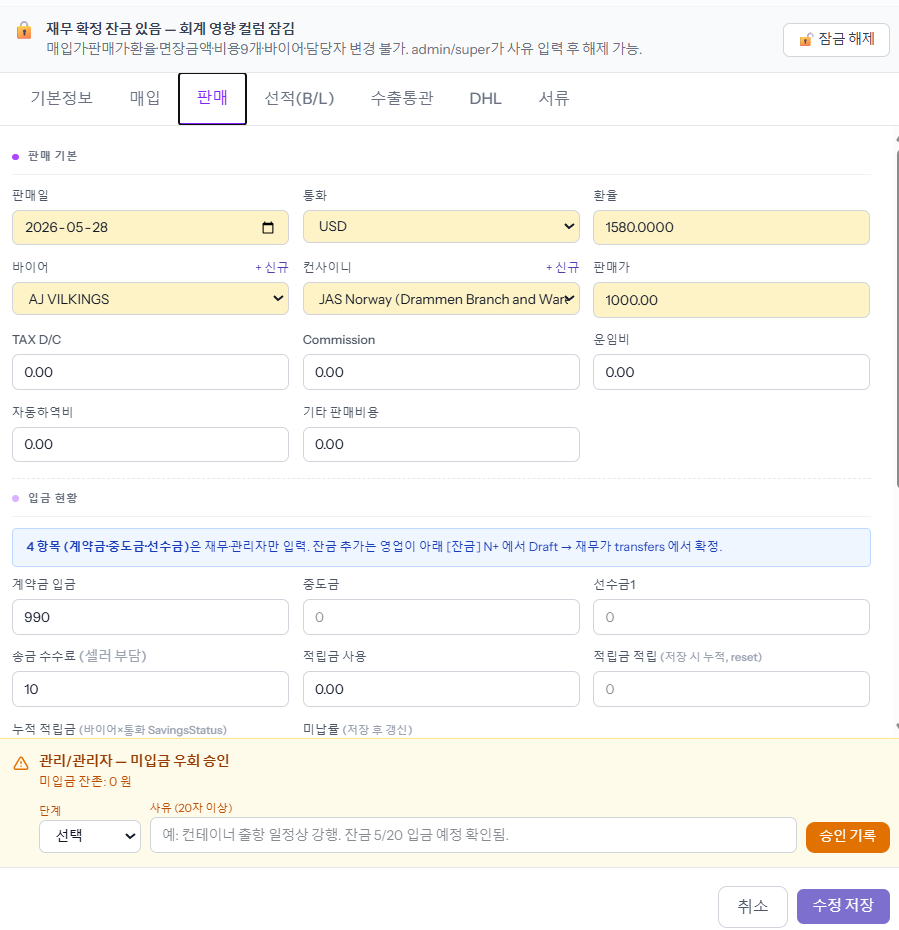

저장하면 **"재무 확정 잔금 있음 — 회계 영향 컬럼 잠김"** 표시되면서 매입가·판매가·환율·면장금액·비용9개·바이어·담당자 변경 불가 잠금 (관리/관리자가 사유 입력 후 잠금 해제 가능).

이제 **바이어 관리 → 그 바이어 클릭** → 패널 상단 보라색 카드 확인:

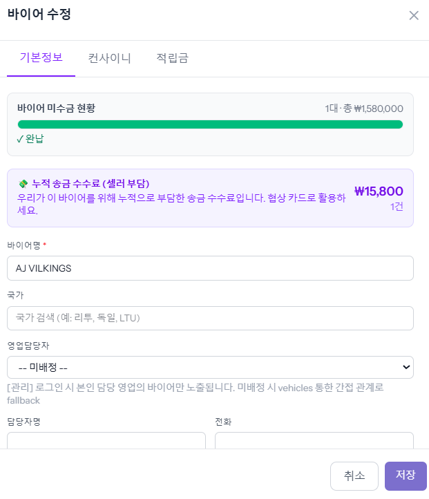

> 💡 **영업 협상 카드**: 카드의 ₩ 금액 = 우리가 그 바이어를 위해 누적으로 부담한 송금 수수료. "그동안 N건, ₩XX,XXX 부담했습니다" 라며 협상 자료로 활용.

> 🔒 막힘: **"확정된 입금은 수정 불가"** 메시지
> → 재무에게 "이 입금 건 확정 취소해 주세요" 요청 → 수정 → 재무가 다시 확정

> 💡 송금 수수료 누락 시: 미수금이 6 USD 같이 어중간하게 남으면 십중팔구 수수료 입력 누락. 수수료 칸에 적어서 0으로 맞추기

---

### 4️⃣ 반입 (선적 — 1차)

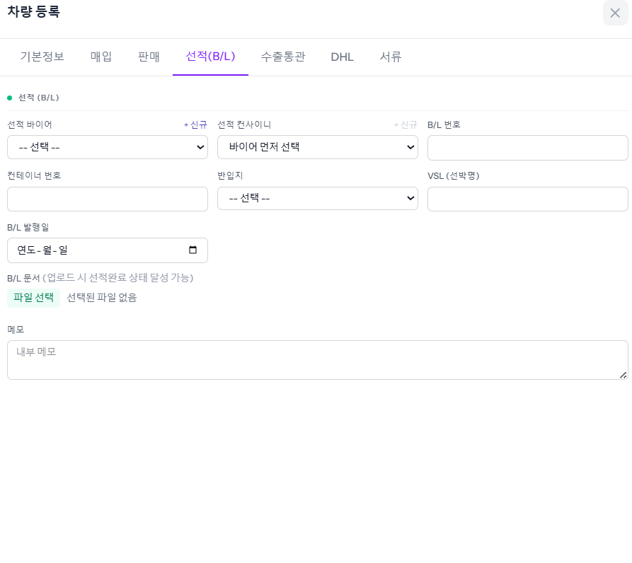

- [ ] **선적 바이어·컨사이니** 선택
- [ ] **반입지** 드롭다운에서 선택 (0-3에서 등록한 부두 중 하나)
- [ ] **컨테이너 번호** + **VSL (선박명)** 입력
- [ ] 진행상태 **"선적중"** 자동 전환 ← 반입지가 들어가면 "선적중"

> 🔓 이 단계 막힘: **없음** (반입지 입력만)

---

### 5️⃣ 통관

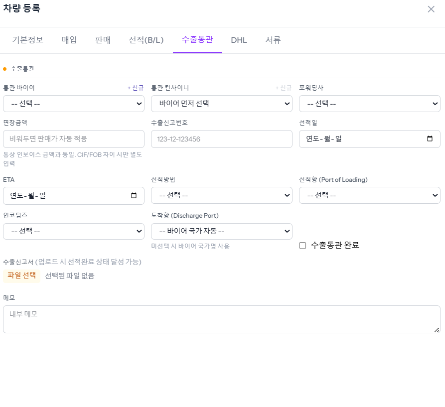

- [ ] **통관 바이어·통관 컨사이니·포워딩사** 선택
- [ ] **면장금액** — 수출신고서에 적힌 USD 금액. **비워두면 판매가가 자동 적용**. 통상 인보이스 금액과 동일. CIF/FOB 차이 시만 별도 입력
- [ ] **수출신고번호·선적일·ETA(도착예정일)** 입력
- [ ] **선적방법** (RORO / 컨테이너) + **선적항** (Port of Loading)
- [ ] **인코텀즈·도착항** 선택
- [ ] **수출신고서 파일 업로드** → 진행상태 **"선적완료"** 자동 전환
- [ ] **"수출통관 완료" 체크박스** → 진행상태 **"통관중"** 으로 표시 (B/L 받기 직전까지 "통관중" 유지)

> 🔒 막힘 ①: **"미수율 N% — 통관 진입 불가"** (입금 50% 미만 차량)
> → 두 가지 해제 방법:
> - (a) 입금 더 받기 → 50% 이상으로 만들기
> - (b) **재무처리 메뉴 → "수출입금 게이트 우회"** → 차량 선택 → 사유 입력 → 승인 (관리/관리자만 가능)

> 🔒 막힘 ②: **외화 차량인데 환율 미입력**
> → 판매 탭으로 가서 환율 입력 (이건 우회 불가, 환율 꼭 입력해야 함)

---

### 6️⃣ B/L (선적 — 2차)

선적(B/L) 탭으로 다시 돌아가서:

- [ ] **B/L 번호·B/L 발행일** 입력
- [ ] **B/L 문서 업로드** ("업로드 시 선적완료 상태 달성 가능" 안내 옆 파일 선택)
- [ ] 진행상태 **"거래완료"** 자동 전환 ← B/L 업로드가 거래완료 트리거

> 🔒 막힘: **"잔금 미입금 — B/L 발급 불가"** (잔금 100% 완납 필수)
> → **통관(50%)과 다름. B/L은 100% 받아야 함.**
> → 해제 방법:
> - (a) 잔금 100% 받기
> - (b) **재무처리 메뉴 → "수출입금 게이트 우회"** → 차량 선택 → 사유 명시 → 승인 (관리/관리자만 가능, 통관 우회와 **별개로 한 번 더 발급 필요**)

---

### 7️⃣ DHL

- [ ] **DHL 탭** → 수취인·발송인·중량·크기 입력
- [ ] "DHL 발송신청" 체크

> 🔓 이 단계 막힘: **없음** (정보 입력만)

---

### 8️⃣ 정산

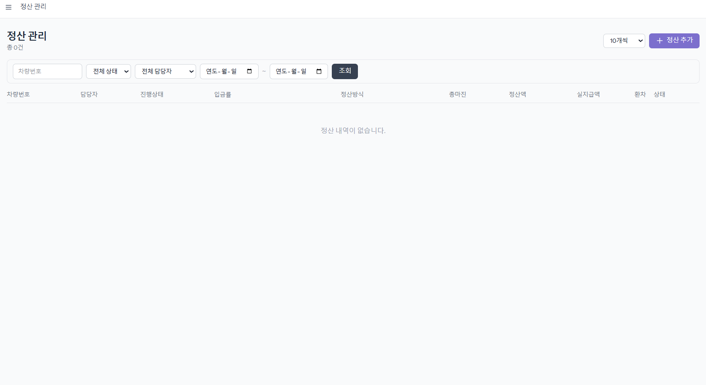

- [ ] B/L 업로드(=거래완료) 시점에 정산 자동 생성됨
- [ ] **정산 관리** 메뉴에서 마진·정산액·실지급액 확인
- [ ] 영업담당자가 **프리랜서**면 자동으로 비율 50%, **사내직원**이면 건당 10만 원이 채워짐 (필요하면 수정 가능)
- [ ] **재무**가 검토 후 "확정" 처리 → 상태가 **"확정"**
- [ ] 지급 처리 → 상태 **"지급완료"**

#### 💰 정산 마진 공식 (영업 협상 시 참고용)

```
판매금원화        = (판매가 + Commission + 자동하역비 - TAX D/C) × 환율
정산판매금원화    = 판매금원화 - 비용9개 합계
판매마진          = 정산판매금원화 - (매입가 + 매도비)
부가세마진        = 매입가 × 9%
총마진            = (판매마진 + 부가세마진) × 0.9   ← × 0.9 = 부가세 10% 차감

정산액 (영업담당자 타입 별):
  - 프리랜서 (비율)  = 총마진 × 50%   (기본값)
  - 사내직원 (건당)  = 100,000원        (기본값)

실지급액          = 정산액 - 서류비 - 기타공제
  서류비: 프리랜서 = 50,000 / 사내직원 = 0
```

> 🔒 막힘: **"확정된 정산은 수정 불가"** 메시지
> → 재무에게 "이 정산 확정 취소해 주세요" 요청 → 수정 → 재확정

---

## 📊 일상 모니터링

매일 한 번씩 확인:

### 재고관리

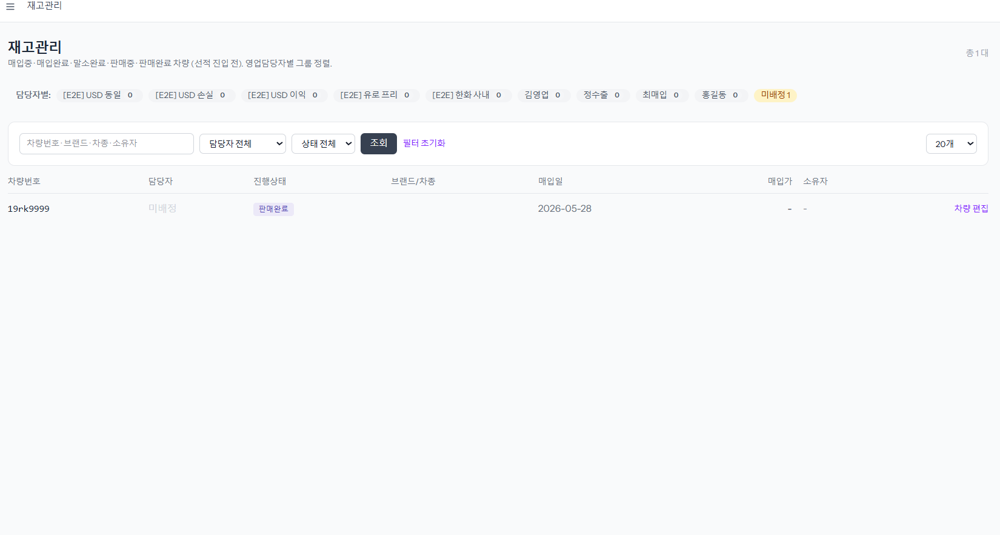

- [ ] 담당자별 그룹 정렬 (매입중·매입완료·말소완료·판매중·판매완료 차량 — 선적 진입 전)
- [ ] 미배정 차량 발견 시 영업담당자 배정

### 채권관리

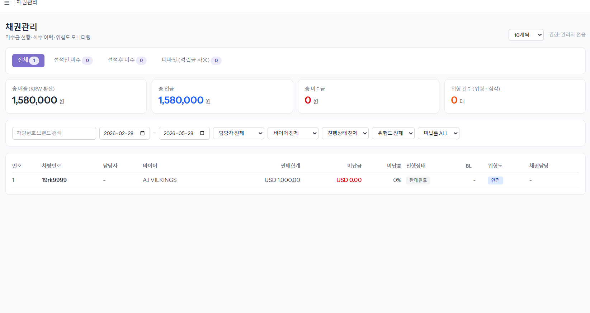

- [ ] **총 매출 / 총 입금 / 총 미수금 / 위험 건수** KPI 확인
- [ ] **위험도** 필터로 안전/주의/위험/심각 분류
- [ ] 미납률 0% 못 박힌 차량들 점검

### 재무 처리


- [ ] **자금 이체·판매 잔금·매입 잔금** 탭 — 재무 대기 건 확인
- [ ] **수출입금 게이트 우회 발급** 도 이 화면에서 (락 해제용)

### 바이어 카드

- [ ] **바이어 관리 → 바이어 클릭** → 패널 상단 💸 보라색 카드 — 누적 송금 수수료 (영업 협상 자료)

### 데이터 안전성

- [ ] **자동 백업** — 매일 새벽 3시 AWS S3 자동 백업 (cron). 노트북 망가져도 안전
- [ ] **운영 서버**: `52.79.200.151` (Lightsail)

---

## 🔓 락 해제 권한 정리 — 누가 풀 수 있나

| 락 종류 | **관리(나)** | 재무 | 관리자(admin) |
|---|---|---|---|
| 통관 50% 게이트 (`unpaid_export_overrides`) | ✅ 직접 우회 발급 | ❌ | ✅ |
| B/L 100% 게이트 (`unpaid_export_overrides`) | ✅ 직접 우회 발급 | ❌ | ✅ |
| 입금 확정 후 수정 | ❌ 재무에 요청 | ✅ | ❌ |
| 정산 확정 후 수정 | ❌ 재무에 요청 | ✅ | ✅ |
| 정산 **지급(paid) 후** 잔금 추가 | ❌ 불가 | ❌ 불가 | ❌ 불가 (회계 무결성 — 별도 회계 처리) |
| 외화 환율 미입력 | (우회 불가) | (우회 불가) | (우회 불가) |
| 말소 RRN/주소 누락 | ❌ 차량 등록증 보고 수기 입력 | ❌ | ❌ |
| Ledger 영향 컬럼 잠금 (매입가·판매가·환율·면장금액·비용9개 등) | ✅ 사유 입력 후 잠금 해제 | ❌ | ✅ |

---

## 🆘 자주 발생하는 문제 + 빠른 해결

| 증상 | 해결 |
|---|---|
| 차량 목록에 그 차량이 안 보임 | 그 차량 담당 영업담당자가 내 휘하인지 확인. 아니면 admin에게 매핑 요청 |
| 말소신청서 RRN 칸이 비어있음 | 기본정보 탭 → 소유자 주민등록번호 수기 입력 → 서류 재생성 |
| 진행상태가 안 바뀜 | 새로고침 → 잠시 후 다시 확인 → 안 되면 개발자(진)에게 문의 |
| "수출입금 게이트 우회" 발급했는데도 막힘 | 통관용/B/L용은 별개 우회임. 두 단계 다 발급 필요 |
| 정산액이 0으로 표시 | 영업담당자의 **정산 분류**(프리랜서/사내직원) 지정됐는지 확인 (사용자 관리에서) |
| 미수금이 5~10 USD/EUR 어중간하게 남아 있음 | 십중팔구 은행 송금 수수료 누락 — 판매 탭의 "송금 수수료" 칸에 입력하면 0으로 맞춰짐 |
| 바이어 누적 수수료 카드(💸)가 안 보임 | 그 바이어 차량 중 송금 수수료 입력된 게 0건. 또는 환율 비어있음. 차량 편집 → 환율 + 송금 수수료 입력 후 저장 |
| 엑셀 컨사이니 import 시 "영업담당자 미등록" 에러 | 양식의 영업담당자 이름이 시스템 영업담당자명과 정확히 일치해야 함 |
| 차량번호 입력해도 NICE 자동조회 안 됨 | 수동 입력 가능. 안 되면 개발자에게 NICE 키 만료 여부 확인 요청 |
| 서류 다운로드가 안 됨 | 분당 30회 / 차량당 분당 10회 제한 있음. 잠시 후 재시도 |
| Ledger 영향 컬럼이 잠겨서 수정 불가 | 패널 상단 "잠금 해제" 버튼 → 사유 20자 이상 입력 → 잠금 1회 해제 (저장 후 자동 재잠금) |

---

## 💡 한 줄 요약

> **매입 → 말소(RRN·주소 필수) → 판매(수수료 입력) → 반입(선적) → 통관 → B/L → DHL → 거래완료 → 정산**
>
> 통관·B/L에서 막히면 **재무처리 → 수출입금 게이트 우회**.
> 입금·정산이 확정 후 수정 필요하면 **재무에 취소 요청**.
> 정산 **지급(paid) 후엔 수정 불가** — 별도 회계 처리.
